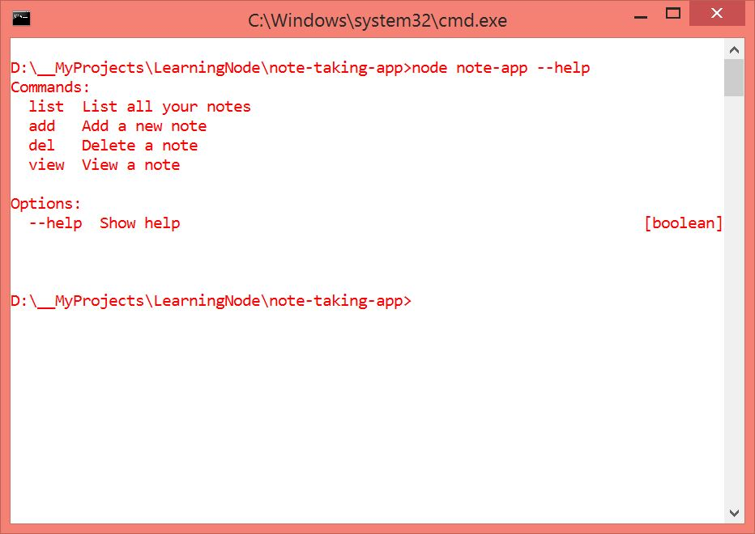

#Note Taking Command Line Utility
* This is a command line utility to take notes on the go
* This is the third app by me while learning Node
* It uses Yargs and Lodash libraries

###Screenshot

####How to run?

_In the terminal, type **npm install & npm start** to setup and run the application._

**You liked it? _Star it_ !**