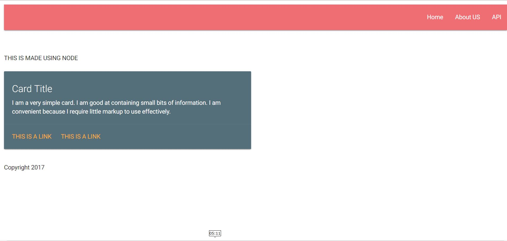
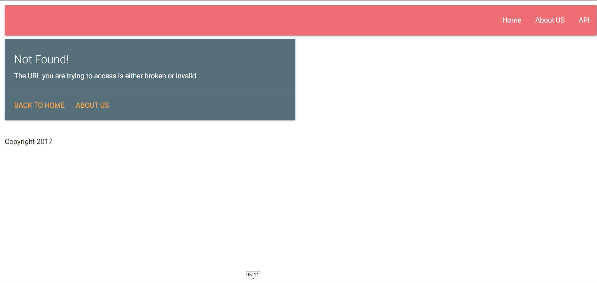

#Simple NodeJS Website
* This is the fifth app by me while learning Node
* It uses **Express** and **Handlebars(hbs)** as templating engine, **MaterializeCSS** for CSS
* It includes the header and footer from the **views/partials** folder
* It also shows a 404 page in case of invalid urls
* It logs the requests and timestamp in the **server.log** file located in **logs** folder

###How to Setup and Run?

* _In the terminal, type **npm install & npm start** to setup and run the server first_
* _Open your favourite browser, type **localhost:5000"**_

###Screenshots

**_Main Page_**

 

**_404 Page_**

###See maintaniance in action

_Remove the comments in the line number 26-28 in **serve.js** to see the maintainance state of the app_ 

###Uses
* You can use if for serve the static pages of your website
* You can setup the routes in the **server.js** file according to your needs for the above purpose.

**You liked it? _Star it_ !**
