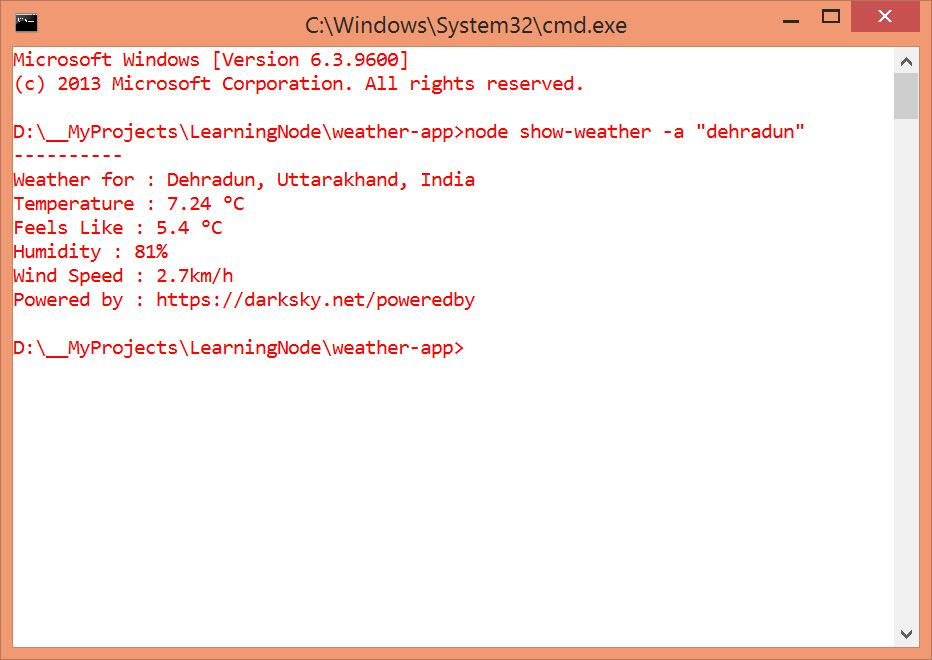

#Weather App - A Command Line Utility
* This is a command line utility to get the weather details
* This is the fourth app by me while learning Node
* It uses **Yargs** and **Request** libraries

###How to Setup?

_In the terminal, type **npm install & npm start** to setup and run the application._

###How to Run?
_Open terminal, type **node show-weather -a "address/pin code/city name"**_

###Screenshot

**You liked it? _Star it_ !**